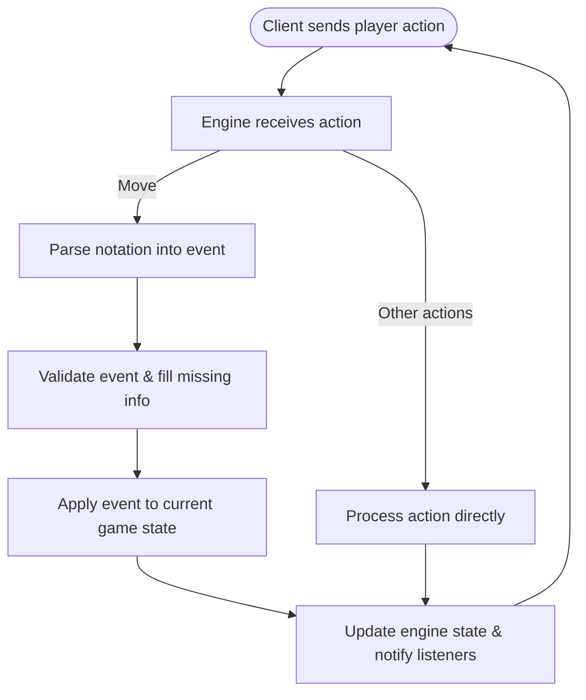

# Overview
This is a game engine made specifically for chess.
It provides all core game logic, state management and abstractions, and can serve as a backbone for a chess UI or other chess-related programs.

The project provides multiple levels of abstractions that form a coherent whole but can also be used independently.
From the top-level orchestrator, `Engine`, down to components such as the game-state, down to fundamental chess concepts such as pieces, squares and positions.

In terms of design philosophy, the project is highly modular and functional-leaning.
All components are immutable — the only exception is the `Engine` class itself, as it is the stateful orchestrator of games and sessions.

It also attempts to expose a DSL-like interface that allows the different components to "speak" in chess and engine terms, mainly via event objects, core data definitions, and meaningful behaviors and names, that reflect both chess terminology and the engine's architecture.

# Structure
## The `Engine` class
The core of the project is the engine object, represented by `Engine`.
It serves two primary functions:
1. **Coordinate game sessions:** load a new game or an existing game, and terminate a game once it ends.
2. **Orchestrate the game itself:** perform player actions, such as playing moves, offering draws, and resigning.

`Engine` itself does not contain the game logic. 
It manages the other components, each of which is responsible for a part of the process.

This is the only part of the project that provides a deliberate public-facing interface.
It does so via an event-listener model; listeners receive exactly one update per action whether it succeeded or failed. The update fully describes the result - either the new engine state or the details of the error.
> Do not confuse the event\listener model mentioned here with the internal event system, which is explained later,
  and uses concrete event objects for internal engine workflow.

## Workflow
After an `Engine` object is initialized, and listeners are registered, it must be set up with a game session, either for a new game or an existing one. Listeners are notified when a new session is set up.

A regular move proceeds as follows:
- A player makes a move using chess notation.
- The move is interpreted and converted into an event object.
- The event is validated for chess rules consistency, and ambiguities are resolved.
- The resulting action is applied to the current game snapshot to produce a new one.
- The engine updates its state to the new one and notifies listeners of the update.

If at any point throughout this process something goes wrong, the engine notifies the listeners with an appropriate error object.

Not all player *actions* are *moves*; Draw offers, claims and resignation bypass the move-processing flow and are handled directly by the engine, with draw claims also relying on derived game state. 
Here too, listeners get notified whether an action succeeded or failed.

After a game ends, any further move attempts are rejected. A new session must be set up in order to start the whole process again.

## Core components
Three core components form the backbone of the engine workflow:
1. **Notation Parsers:** parses chess notation into engine events.
2. **Event Handlers:** validates event legality and infers missing information.
3. **The Game model:** represents the game state, produces new states and answers queries.

Those communicate via events, which the parser produces for the rest of the engine to process.

### The event system
Events are structured representations of player moves — moving a piece from square A to B, capturing, promoting, etc — where each event corresponds to exactly one player turn. A complete event records all direct facts about the move itself: what moved, where it moved, what was captured, and so on. It does not describe derived implications like checks or checkmate; those are determined from the resulting state.

Some notation system attach extra annotations to moves (e.g., "x" for capture, "!" for good move).
Events can store this metadata for compatibility and completeness reasons, but it is separate from the information they supply to the engine for processing.

As a valid event is processed through the engine, it gradually becomes more complete. By the end of the pipeline, the event includes the full set of concrete facts needed for the state transition.

### Notation Parsers
Parsers take user input, each using a specific type of chess notation(*SAN*, *LAN*, etc), and translate it to an event.
Their job is strictly syntactic: they interpret the notation and extract the information it encodes.
They do not check whether the move is legal, unambiguous, or even physically possible on the current board.

While the engine supplies parsers, clients can make their own as long as they uphold the parser interface.
An `Engine` instance has a default parser, but clients may supply a different parser for any given move. 

### Event handlers
Events may still be illegal after parsing. 
Moreover, while some notation systems only supply the bare minimum information required for making a move,
the corresponding events have to be much more detailed for the rest of the engine to process them in meaningful ways.

Event handlers are responsible for completing both of those tasks.
Using the current game state, they check whether the event corresponds to a legal move, and they fill in any missing details to make the events fully specified and ready for state transition.

Each event type is structured differently and requires different validations, and therefore has its own dedicated event handler.

### The Game model and State
The `Game` module is responsible for the full game snapshot.
This is done primarily through its `State` class.
Each `State` object is a complete representation of the state of the game at a specific point in time, with everything that it entails:
The board, the current player, the history, and so on.
By applying a valid event, the `State` produces a new `State` object which represents the result of making that move.

Another important `Game` component is `Query`, which provides information derived from a `State`: the currently legal moves, whether a player is in check, whether a draw claim is possible, and so on. `Query` encapsulates most of the rule logic that depends on the actual state.
Some of the more rudimentary rules are encoded directly in the data definitions. For example, a piece's geometrical movement(how it could have moved on an empty board) is part of the `Piece` class, but the actual, state-aware movement check is supplied by `Query`.

## Data definitions - the shared language
Chess and chess engines have rich terminology.
Names throughout the project — methods, objects, and so on — aim to reflect this terminology, though most are relevant only in specific local contexts.

A smaller subset of terms, however, is used across the engine.
Those include *pieces*, *squares*, *positions* and *boards*, as well as engine-specific concepts like the event system.
Together, they form the engine's core vocabulary: the shared definitions understood by all engine components.

While data definitions are mostly self-explanatory, some points are worth noting:
1. **Pieces, squares, boards and positions are all value objects**: they are compared based on their contents, not identity.
2. **Pieces and squares are not state-aware:** they describe the thing itself without linking to any state.
   A piece does not know its current square or whether it is still in play.
3. **Board vs position vs state:** Some engines confuse the board with the position or even full game state. In this engine, the board is just a representation of a game board, with pieces, squares, and associated operations.
4. **`Position` vs `Game::State`:** a position describes a snapshot of a single turn. A `State` is a fully-fledged engine component, including game history and behavior for advancing the state.  

## Other components
### The error system
The engine's approach to errors is divided into two categories:
- **user-facing errors:** treated as data and sent back to listeners as updates (e.g., illegal moves, mistyped notation, invalid draw offers).
- **Internal errors:** failures in internal components, which raise exceptions. Those indicate bugs or misconfigured state and should not occur under normal use.

This separation allows the engine to handle expected client mistakes gracefully while ensuring that internal issues are loud and obvious.

### Formatters
A formatter takes events and translates them back into a specific type of chess notation; they are the inverse of parsers.
Formatters exist at the same abstraction level as core components but are not part of the main engine workflow, and not currently used anywhere in the engine itself.

The primary use of a formatter is for clients: to translate the engine's internal language into their preferred notation or abstract move system. Similarly to parsers, clients can make their own formatters as long as they follow the formatter interface.

# Design decisions and limitations
## Immutability
Making everything except `Engine` immutable has several benefits:
- It makes the engine's correctness easier to reason about and test.
- It makes state transitions significantly easier.
- It allows the different components to be truly independent.

However, professional chess software usually do not utilize immutability, and for good reason:
in the context of a game like chess, with millions of possible game states, it is simply too slow.
Engines rely heavily on incremental updates and fast move-undo operations while exploring deep game trees.
Creating and discarding a full state object for every such possibility introduces significant overhead.

Granted, most of those programs are geared towards making chess AIs. This is not a core goal of this project, and therefore convenience and correctness outweigh raw performance.
A sort of a middle ground could be achieved by implementing "pseudo immutability": keeping a mutable core hidden behind an immutable interface. But this will require a substantial redesign and is left as possible future work.

## Abstraction
This engine is intentionally highly abstract: it defines many small, domain-specific objects instead of relying directly on the programming language's built-in constructs.
Other engines often take the opposite approach - for example, using symbols for squares, like `e4` or `g6`, instead of `Square` objects. 

One drawback of our approach is the same drawback of immutability: performance. Each update involves the creation of multiple short-lived value objects, and that overhead accumulates.

Another, more subjective drawback, is verbosity. Working with objects such as `Piece[:white, :pawn]`, as opposed to something simpler like `"P"`, can feel heavy - both in typing and in the mental overhead in dealing with an additional abstraction.

But a simpler design sometimes only appears simpler. The complexity of the structured object doesn't disappear - it spreads throughout the codebase, leaking to any place that utilizes it. This creates duplication, inconsistency, and subtle bugs. This engine opts for explicit, well-defined abstractions because they produce clearer behavior and safer correctness properties, at the cost of the inevitable overhead.

Finally, two major design goals of this project are composability and expressiveness: because every concept maps to a well-represented construct, specific parts can be swapped or extended without disturbing the rest, and the shared language inside the project makes the engine read more like a description of chess rather than a sequence of rudimentary operations.

## Other limitations
For the sake of completeness, it should be mentioned that the engine does not include any support for:
- **Concurrency:** it was not build with thread-safety in mind. Making it work in a concurrent context would require design changes and is currently outside of the project's goals.
- **Chess tournament features:** clocks, timers, and tournament-specific rules and behaviors aren't included. Those belong to clients built on top of the engine, not the engine itself.

# More information
This was a conceptual overview. For a concrete code layout, see the [namespace map](namespace_map.md).
For details on the custom notation developed for this project, check out [ERAN.md](ERAN.md).